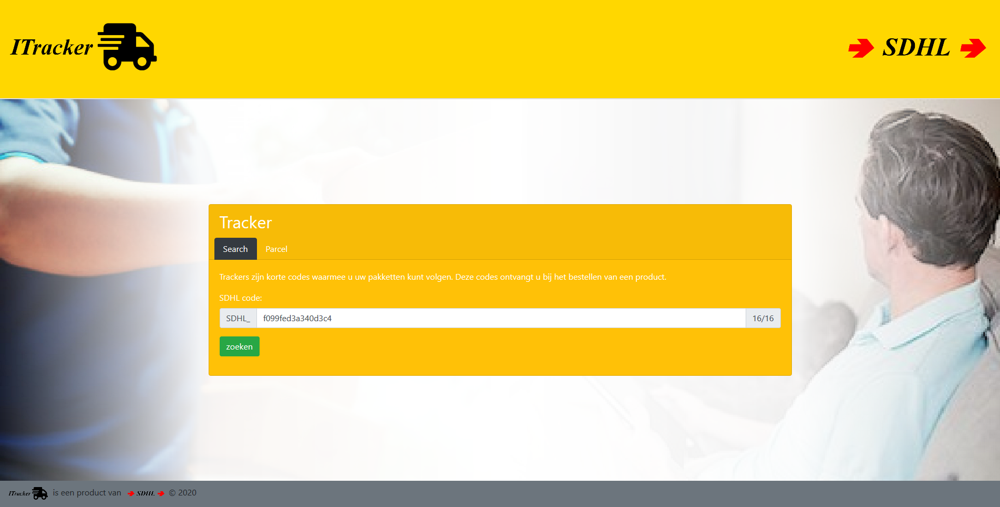
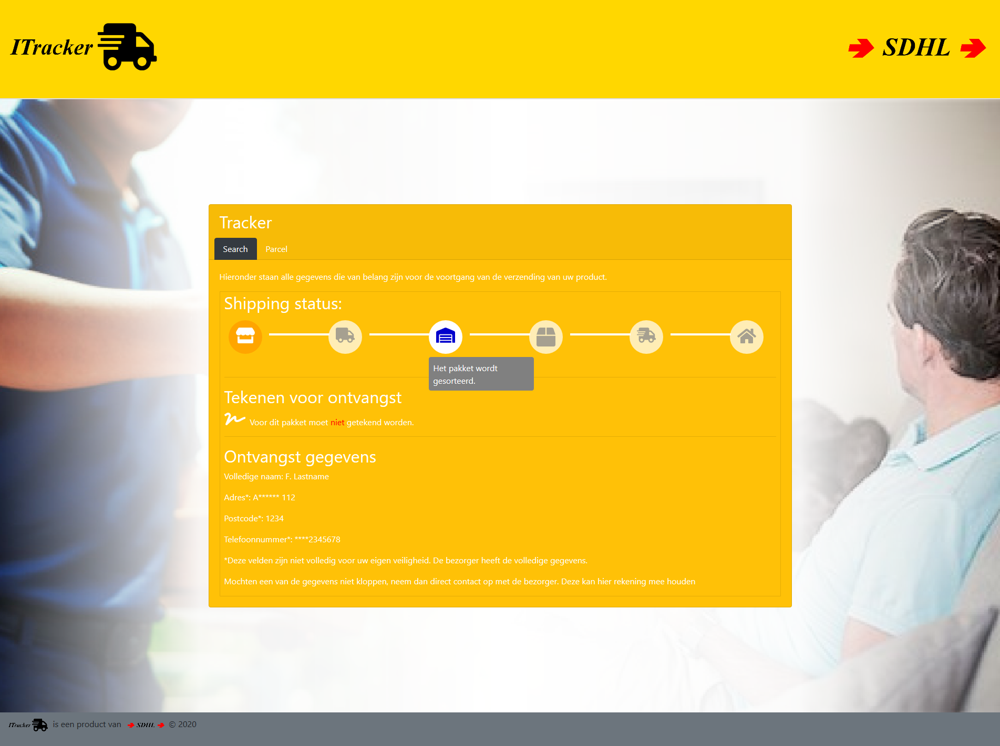

# ITracker
The ITracker is a project that focusses on the core functionalities of 
Django, python and  what Kindermedicijn uses for projects.  
  
## Prerequisites
Before you start creating the application there are a couple of 
requirements you should keep in mind:
* Install the LTS of Ubuntu OS(On a seperate HardDisk) this is mandatory
- Install Pycharm Community edition or Visual Studio Code
- Install Git
- Create a GitHub Account
- Clone [this](https://gitlab.com/SetaHoefnagel/itracker.git) repository

Beside these requirements you should have some basic knowledge of git, 
python, django, HTML, Webpack(for the building of SASS/CSS and JS). 

The following references can be used to gather information about the 
methods that are in use.
* [Django tutorial](https://docs.djangoproject.com/en/2.1/intro/tutorial01/)
* [Python basics](https://www.w3schools.com/python/) 
* [Virtual Environments in Python](https://uoa-eresearch.github.io/eresearch-cookbook/recipe/2014/11/26/python-virtual-env/)
* [HTML basics](https://www.w3schools.com/html/) 
* [CSS basics](https://www.w3schools.com/css/) 
* [Bootstrap 4 basics](https://www.w3schools.com/bootstrap4/)
* [SASS basics](https://www.w3schools.com/sass/) 
* [JS basics](https://www.w3schools.com/js/) 
* [GitLab workflow](https://docs.gitlab.com/ee/workflow/gitlab_flow.html)
* [REST API resource naming guide](https://restfulapi.net/resource-naming/)
* [PyCharm](https://www.jetbrains.com/help/pycharm/quick-start-guide.html)
* [Ubuntu](https://help.ubuntu.com/stable/ubuntu-help/getting-started.html.en)
* [An Intro to Git and GitHub for Beginners](https://product.hubspot.com/blog/git-and-github-tutorial-for-beginners)

## Webapplication
Webpack, React, TypeScript, Sass.
A courier from "Sneller dan het Licht"(SDHL) has asked you to create a 
webapplication for them. 
There are a couple of ideas he had for the webapplication, he wants the 
following;  
* For the website: 
  * In the header/navigation contact details and the logo of ITracker. 
  * Custom css for the website. 
  * In the footer contact details and the logo of SDHL. 
* For the parcels: 
  * A unique code for the parcel
  * The first and last name of the recipient
  * The address of the recipient
  * The status(a selection of 'Not shipped', 'sent to distribution center', 'sorted at distribution center', 'Shipped', 'Delivered') 
  * Signature(Yes or No)
* Some sort of admin panel in which he can add new parcels. 

Beside all the requirements the courier had, there are some requirements mandatory to create the webapplication: 
* The usage of Django models
* The homepage, here users should be able to enter their parcel code and get an overview of the status of their parcel
  * This must be done with an API call with JavaScript to the status api url. 
* The creation of an API
  * GET /api/parcels/<PARCEL_CODE>
  * This API call is used to get the data of a parcel, based on the code
  * RETURN JSON: 
```
  {
      "id": UUID,
      "barcode": "SDHL_<16HEX_CODE>",
      "signature_required": boolean,
      "recipient": {
          "id":UUID,
          "full_name": string,
          "telephone": string,
          "address": string,
          "zip": string
      },
      "shipping_statuses": [
          {
              "status": string,
              "updated": datetime,
              "description": string
          },
      ]
  }
```
```
## Screenshots of the product




  
